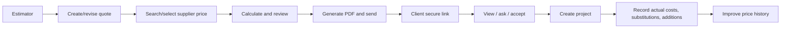
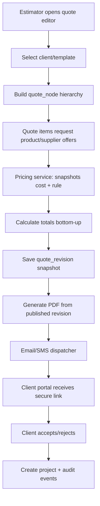
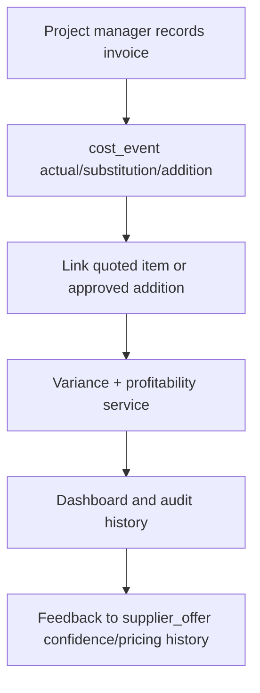
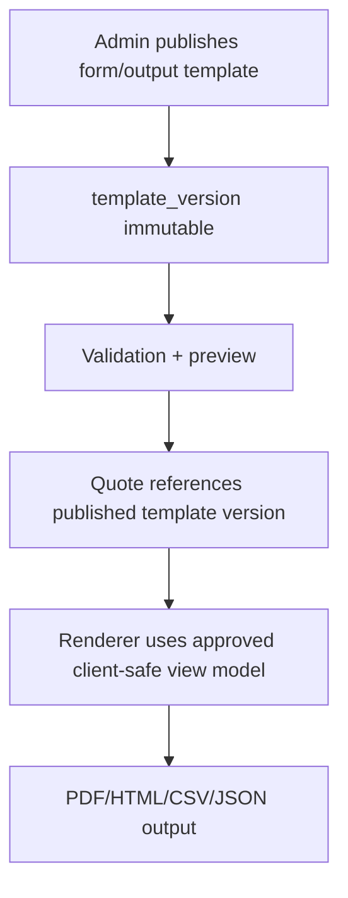

# 02. Requirements Engineering

## Functional requirements and testable acceptance

| ID | Requirement / user story | Acceptance criteria |
|---|---|---|
| FR-01 | As an estimator, create a draft quote with unlimited nested sections and items. | Reorder/add/delete hierarchy; totals roll up deterministically; cycle/depth validation prevents corrupt trees. |
| FR-02 | As procurement, maintain suppliers, contacts, products, prices, effective dates, and performance notes. | A product returns active and historical supplier offers; changes retain actor/time history. |
| FR-03 | As an estimator, choose a supplier cost and pricing rule. | Quote item stores immutable cost, markup rule, sell-price snapshots and currency/tax inputs. |
| FR-04 | As a PM, record invoices, substitutions, and additions. | Variance and gross-profit views include each cost event and identify quote-item linkage or approved extra. |
| FR-05 | As a client, securely view and accept/reject my quote. | Client only sees its organization/projects and published client-facing values; accept/reject creates audit event. |
| FR-06 | As an administrator, define approved form fields and output templates. | Published template version renders validation-safe content; draft/rollback preserves historical output. |
| FR-07 | As sales, generate a branded PDF and email it. | Generated document is versioned, linked to a frozen quote revision, downloadable by authorized parties, and delivery status is recorded. |
| FR-08 | As an opted-in client, receive an SMS quote alert. | SMS contains minimal summary and an expiring, single-use secure link; STOP opts out and no permanent password is sent. |
| FR-09 | As an estimator, expand item/section details and drill down into cost breakdowns. | Clicking an item or total opens a popup/sheet showing quoted cost, markup, supplier offers, actual-cost events, and child-line rollups; drill-down navigation does not overwrite quote data. |

## Core use cases

**Create quotation:** authenticated estimator selects client/template, builds hierarchy, adds items, accepts or enters supplier offers, reviews missing-price flags and totals, then saves a versioned draft. Publish is blocked while required pricing/validation is incomplete.

**Client access:** a known client signs in; a first-time client opens a one-time activation link, proves link possession, chooses their own password, then signs in. The client may view the published quote, approved progress, documents, and client-facing total—not internal cost/margin data.

**Actual costs:** PM maps an invoice/purchase cost to a quoted item, records a replacement with reason/approval or an additional item with scope authority, and reviews variance. Source quote values are never overwritten.

## Non-functional requirements

| Category | Requirement |
|---|---|
| Accessibility | WCAG 2.1 AA keyboard, focus, contrast, labels, error summaries; test core flows. |
| Compatibility | Current and prior major Chrome, Edge, Firefox, Safari; responsive 320 px+ client portal. |
| Security | TLS, RBAC/tenant scoping, server validation, hashed passwords, audit logs; details in [Security](06-security-considerations.md). |
| Performance | product lookup p95 <500 ms at expected MVP data volume; calculation results reproducible without floating-point currency errors. |
| Availability/data | transactional writes, daily backup, defined RPO/RTO in [Disaster Recovery](21-disaster-recovery.md). |
| Customization | rendering must not execute tenant-supplied JavaScript; published configuration version is immutable. |

## Data flow diagrams

## Requirement governance
The product owner maintains IDs, priority (Must/Should/Could), traceability to tests, and acceptance evidence. A change requires impact on data, security, UX, cost, and schedule before sprint commitment. Detailed contracts/data structures are in [System Architecture](03-system-architecture.md); specialized behavior is in [Pricing](14-dynamic-pricing-architecture.md), [Cost Tracking](16-project-cost-tracking.md), and [Customization](11-input-output-customization.md).
