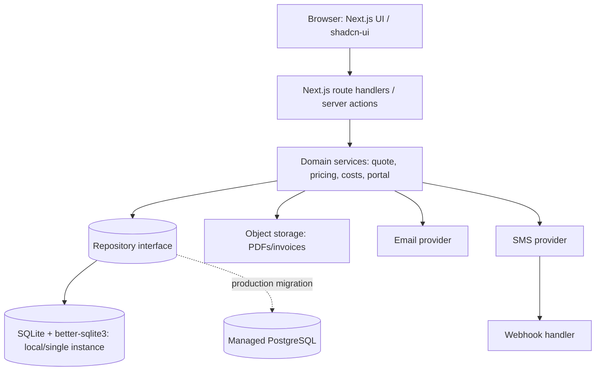
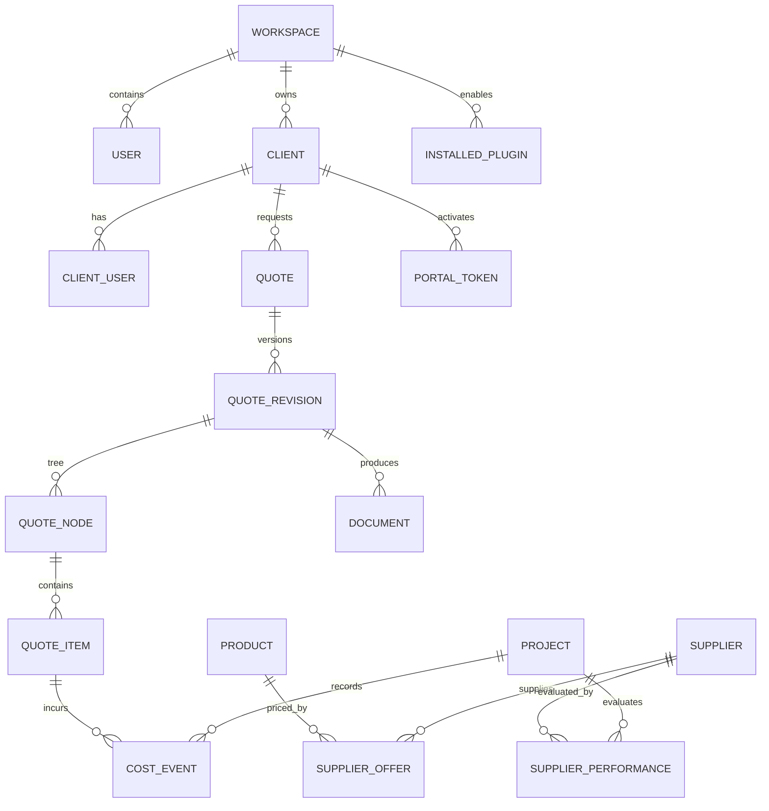
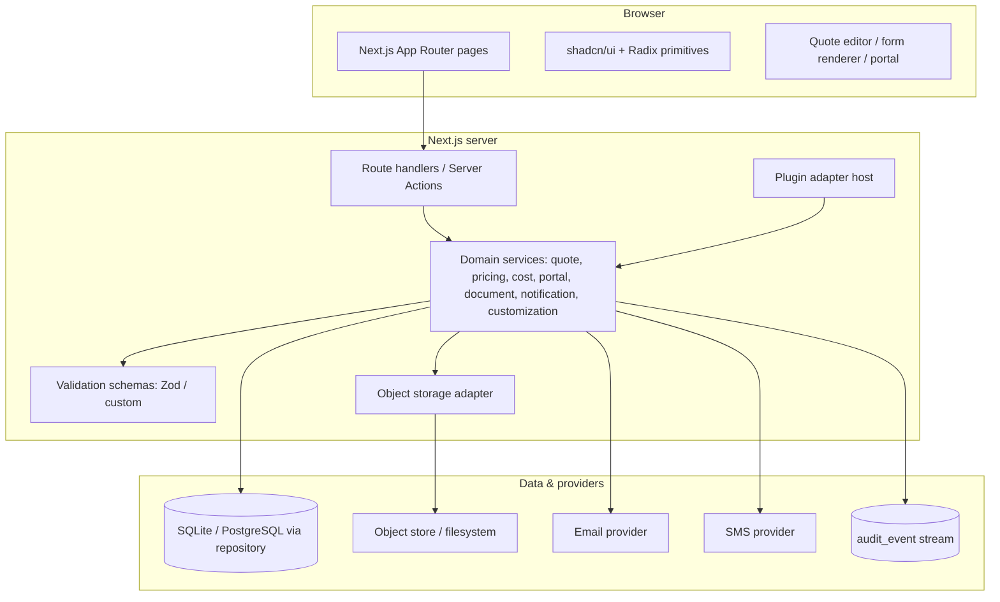

# 03. System Architecture

## Architecture and deployment boundary



Next.js/TypeScript provides one typed application; shadcn/ui offers accessible primitives without locking domain behavior into a vendor. SQLite/better-sqlite3 is appropriate for development, on-premise, or **one persistent application instance with mounted durable storage and backups**. It is not a production default for Vercel/Netlify serverless or multi-instance deployment: their ephemeral/multiple runtimes cannot provide a shared durable SQLite database or safe concurrent writes. Before such production deployment, move through the repository interface to managed Postgres, test migrations/restore, and enable connection pooling.

## Data model



| Entity | Essential fields and constraints |
|---|---|
| workspace, user, role_membership | `workspace_id`; role membership; every business record carries workspace scope. |
| client, client_user | client organization/contact; client_user belongs to one client; status and password hash only. |
| quote, quote_revision, quote_node, quote_item | immutable published revision; `parent_node_id`, ordinal, quantity, unit, money in integer minor units, tax; snapshot fields. |
| supplier, product, supplier_offer | offer currency, unit, effective range, source, status; do not mutate historical offer amounts. |
| project, cost_event | `type=actual|substitution|addition`; quoted-item link nullable only for approved addition; invoice/document reference and approval. |
| template, template_version, custom_value | schema/config JSON, draft/published/retired state and immutable published version. |
| document, message, notification, audit_event | object key/checksum, delivery states, consent, provider IDs, actor/IP/request trace. |
| supplier_performance | `supplier_id`, `project_id`, `quote_item_id`, `on_time`, `quality_score`, `notes`, `recorded_by`, `recorded_at`; aggregates into reliability/quality signals. |
| installed_plugin | `workspace_id`, plugin id/version, manifest, config JSON, enabled status; links workspace to approved plugin versions. |

Normalize reusable entities; use JSON only for versioned form schemas/custom values and validate it against a versioned schema. Index workspace/client ownership, quote status/date, node parent/order, product lookup, supplier offer validity, and cost event project/date.

## API and authorization
All `/api/v1` responses use `{ data, meta }` or `{ error: { code, message, requestId, fields? } }`; use 400 validation, 401 unauthenticated, 403 unauthorized, 404 scoped-not-found, 409 version conflict, 422 business rule, 429 rate limit, and 5xx service failure. Server derives workspace/client scope from the session—never from a trusted client parameter.

| Endpoint group | Examples |
|---|---|
| Quotes | `POST /quotes`, `GET /quotes/:id`, `POST /quotes/:id/revisions`, `POST /revisions/:id/publish` |
| Pricing | `GET /products/search`, `GET/POST /supplier-offers`, `POST /pricing/calculate` |
| Costs | `POST /projects/:id/cost-events`, `GET /projects/:id/variance` |
| Portal | `POST /portal/activate`, `GET /portal/quotes/:id`, `POST /portal/quotes/:id/decision` |
| Documents/messages | `POST /revisions/:id/documents`, `POST /notifications/sms`, provider webhook endpoint |
| Customization | CRUD templates/forms; `POST /template-versions/:id/preview` |

Version optimistic writes with revision/version fields. Webhooks require signature verification, idempotency keys, timestamp tolerance, and a dead-letter/retry record. Plugin extensions are manifest-declared server-side adapters with typed input/output contracts, permission review, and no tenant-provided executable code.

## Migration, isolation, and recovery
Use ordered, reversible-where-possible SQL migrations, test seed data, pre/post checks, backups before migration, and a migration ledger. SQLite-to-Postgres: freeze writes or queue them, export canonical tables, import to a staging Postgres copy, reconcile row counts/checksums and money totals, test application and rollback, schedule cutover, retain SQLite read-only backup. Enforce workspace predicates at repository level; enforce client predicates in portal service; audit denied access. See [Deployment](07-deployment-strategy.md) and [Recovery](21-disaster-recovery.md).

## Component architecture



Responsibilities:
- **Route handlers / Server Actions**: authentication, scope extraction, input validation, and thin mapping to domain services.
- **Domain services**: enforce business rules (quote versioning, pricing calculation, visibility policy) and emit audit events.
- **Repository interface**: abstracts SQLite/PostgreSQL and enforces workspace/client predicates.
- **Adapters**: object storage, email, SMS, and plugin extensions all implement a typed port so they can be swapped or mocked.

## API contract examples

All `/api/v1` responses follow `{ data, meta }` or `{ error: { code, message, requestId, fields? } }`.

### Create a draft quote

Request `POST /api/v1/quotes`:
```json
{
  "client_id": "uuid",
  "title": "Reception feature wall",
  "currency": "KES",
  "template_id": "uuid"
}
```

Response `201`:
```json
{
  "data": {
    "id": "quote-uuid",
    "client_id": "uuid",
    "status": "draft",
    "created_at": "2026-07-21T12:00:00Z",
    "workspace_id": "ws-uuid"
  },
  "meta": { "request_id": "req-1" }
}
```

### Add supplier offer

Request `POST /api/v1/supplier-offers`:
```json
{
  "supplier_id": "uuid",
  "product_id": "uuid",
  "unit_amount_minor": 95000,
  "currency": "KES",
  "unit": "m2",
  "effective_from": "2026-07-21",
  "effective_to": "2026-12-31"
}
```

### Publish a quote revision

Request `POST /api/v1/revisions/:id/publish`:
```json
{ "version": 3 }
```

Response `200`:
```json
{
  "data": {
    "revision_id": "rev-uuid",
    "published_at": "2026-07-21T12:30:00Z",
    "document_id": "doc-uuid"
  }
}
```

### Client portal decision

Request `POST /api/v1/portal/quotes/:id/decision`:
```json
{
  "decision": "accept",
  "comment": "Approved as quoted",
  "signed_at": "2026-07-21T13:00:00Z"
}
```

For full endpoint definitions see the OpenAPI spec under `docs/api/openapi.yaml` once generated.

## Performance and internationalization

Performance:
- Use integer minor units for all money; avoid float math in totals.
- Index workspace_id, client_id, quote status/date, node parent/order, product lookup, supplier offer validity, and cost event project/date.
- Cache published templates by checksum; cache compiled PDF templates for hot revisions.
- Paginate large lists (clients, quotes, cost events) and avoid N+1 by using repository joins.
- Run load tests on product search, quote calculation, and PDF render paths.

Internationalization (i18n):
- Store user-facing strings in translation files (`messages/en.json`, etc.); use Next.js i18n routing or a lightweight ICU provider.
- Output templates and email/SMS templates are versioned per locale; administrators can publish locale-specific variants.
- Currency, date, and number formatting use the user's locale plus the workspace reporting currency.
- Right-to-left layout support is a later phase; ensure placeholders in templates are locale-agnostic.

## Expandable details popup

The quote editor and client portal use a read-only detail sheet/popover:
- **Trigger**: row expander or item title click on quote nodes and totals.
- **Content view model**: item metadata, selected supplier offer snapshot, pricing rule, computed sell price, child-line rollup, and actual-cost events if the viewer has cost permission.
- **Behavior**: drill-down into subsections recursively; portal view strips internal cost/margin fields.
- **API**: `GET /api/v1/revisions/:id/nodes/:node_id/details` returns a client-safe or internal DTO based on role.
- **Security**: scope check (workspace for staff, client for portal) and redaction before serialization.

## Supplier performance metrics

Track supplier delivery/quality observations in `supplier_performance`:
- `supplier_id`, `project_id`, `quote_item_id`, `on_time` boolean, `quality_score` 1-5, `notes`, `recorded_by`, `recorded_at`.
- Aggregate into reliability score, average quality, and on-time percentage for smart price input ordering.
- Keep performance data separate from offer pricing to avoid circular price manipulation.

## Scalability and capacity planning

### Scaling dimensions

| Bottleneck | Growth strategy |
|---|---|
| Database reads | Move to managed PostgreSQL, add read replicas for reporting queries, and materialize quote totals on revision publish. |
| Database writes | Keep writes on primary; shard by workspace only if tenant count grows beyond a single database instance. |
| PDF/render CPU | Run rendering in a worker service or queue (BullMQ/Amazon SQS/Azure Queue) with bounded concurrency; cache rendered documents by checksum. |
| Product/offer search | Add full-text index (Postgres `tsvector` or external Meilisearch/Typesense) when search latency exceeds targets. |
| Object storage / CDN | Store PDFs and invoice scans in object storage; serve through a CDN with signed URLs. |
| Session/auth | Store sessions in Redis-backed store or stateless JWT; NextAuth.js adapter can target the same Postgres database. |

### Database limits

- SQLite handles development and single-instance deployments well, but concurrent writes do not scale horizontally.
- The migration path to Postgres is through the repository interface; no domain code should depend on SQLite specifics.
- For managed Postgres, enable connection pooling (PgBouncer/Supabase pooler) to avoid exhausting connections under serverless load.

### Caching strategy

- Cache published templates by version checksum.
- Cache compiled PDF templates and frequently accessed supplier lookups.
- Avoid caching quote drafts; they are user-specific and change frequently.
- Use short TTL for client portal quote detail; invalidate on publish/accept events.

### Horizontal scaling boundaries

- Keep the Next.js application stateless; store uploads, sessions, and jobs outside the container.
- Run background workers (PDF generation, import processing, report generation) on separate compute or as serverless functions with queue triggers.
- Use feature flags to gradually roll out heavy features (XLSX exports, bulk operations) to a subset of workspaces.
