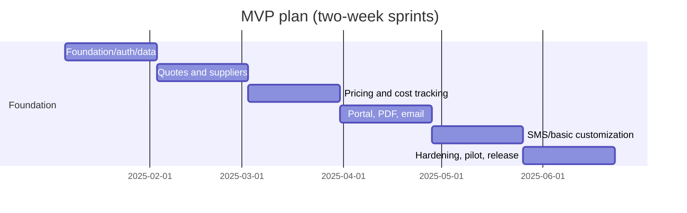

# 08. Project Timeline

## Indicative MVP-first schedule

Dates are planning placeholders; confirm capacity before commitment. Critical path is data model → quotes/calculation → delivery/portal → UAT. Reserve 15% capacity for defects, migration, provider onboarding, and feedback.

## Phase success criteria

| Phase | Measurable success criteria |
|---|---|
| 1 Foundation | CI pipeline green on every PR; auth sign-in for each role succeeds; database migrations run forward and back on a disposable database; build completes in <5 minutes. |
| 2 Core data | 100% of scoped CRUD flows for clients, users, suppliers, products, and offers have automated tests; audit events recorded for every create/update/delete. |
| 3 Quotes | Quote with unlimited nesting saves in <1 s; deterministic rollup matches a reviewed fixture; missing-price status blocks publish; optimistic-lock conflict handled. |
| 4 Pricing/costs | Margin and variance calculations reconcile to the cent on seeded data; cost event types actual/substitution/addition all produce correct variance/profit; approval required for additions. |
| 5 Client delivery | Pilot clients activate unaided and accept/reject a quote; PDF output matches branding sample; portal DTO never exposes supplier cost/margin in negative-authorization tests. |
| 6 Customization | Admin can publish a form/output template, preview it, and roll back; no tenant-supplied JavaScript executes during rendering; all template changes are versioned. |
| 7 Hardening/release | Managed Postgres migration tested and reversible; backup restore verified; monitoring alerts fire on synthetic failure; 80% internal users complete training; zero unresolved critical/high defects. |

| Milestone | Acceptance |
|---|---|
| M1 Foundation | CI, migrations, role-scoped sign-in, seed/demo data |
| M2 Estimator MVP | save/version quote, supplier offer selection, reproducible totals |
| M3 Delivery MVP | PDF/email, portal client sees only published values, decision audit |
| M4 Cost MVP | actual/substitution/addition variance and approval controls |
| M5 Pilot release | security/restore/UAT evidence, trained pilot staff and support handoff |

Team: product owner, technical lead, 2–3 full-stack developers, QA (shared), UX support, and business SMEs. Track sprint velocity without converting it into a delivery guarantee.