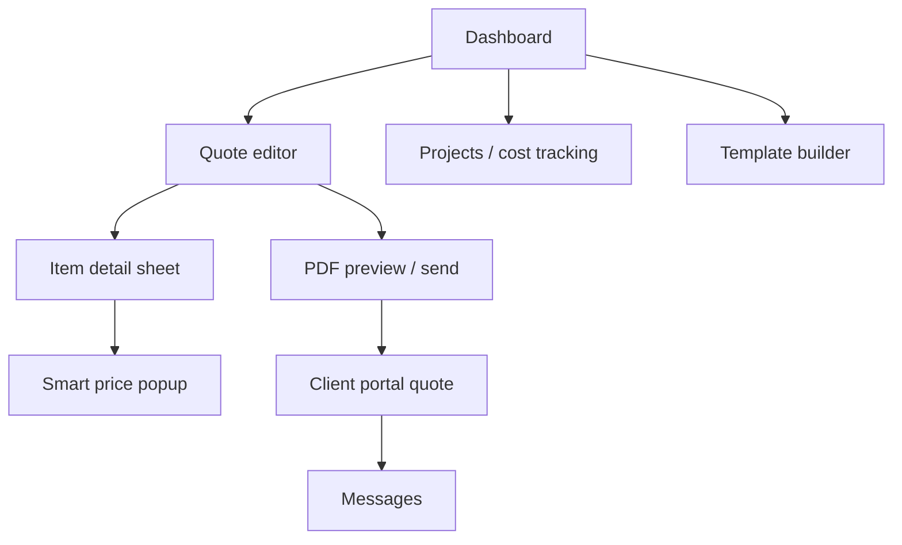

# 27. UI/UX Wireframes

This section documents the key screens and user flows for the Quotation Management System. The final visual design uses shadcn/ui (Radix UI + Tailwind CSS) with a mobile-first responsive layout. A sample PDF output exists in `mock-quotation.html`.

## Navigation model

Internal app:
- Top bar: workspace switcher, global search, notifications, user menu.
- Sidebar: Quotes, Projects, Suppliers, Products, Templates, Portal messages, Reports, Settings.
- Main content area uses a card-based layout with clear primary actions.

Client portal:
- Simplified top bar with logo and profile.
- Dashboard > Projects > Quote detail > Messages.
- Mobile-first bottom navigation on small screens.

## 1. Quote editor

**Purpose**: Create and revise hierarchical quotations.

```text
+--------------------------------------------------+
|  Quote: Reception feature wall    [Save] [Publish]|
+--------------------------------------------------+
| Client: Acme Creative Studio                     |
| Valid until: 2026-08-11  | Currency: KES          |
+--------------------------------------------------+
| #  Description                 Qty   Rate    Total|
| ▼ 1 Section: Signage                                 |
|   ▶ 1.1 Subsection: Illuminated                    |
|       1.1.1 Custom illuminated logo   1  12,500 12,500|
|       1.1.2 3D acrylic lettering      1   6,800  6,800|
|   ▶ 1.2 Subsection: Feature wall                   |
|       1.2.1 Aluminium composite     12m2  950 11,400|
| ▶ 2 Section: Installation                          |
+--------------------------------------------------+
| [+ Section] [+ Subsection] [+ Item]                |
+--------------------------------------------------+
| Subtotal: KES 41,000                               |
| Labour (30%): KES 12,300                           |
| Total: KES 53,300                                  |
+--------------------------------------------------+
```

**Interactions**:
- Drag-and-drop or arrow buttons reorder nodes.
- Clicking a row opens the **item detail sheet** (price, supplier offer snapshot, markup rule, notes).
- Missing prices are highlighted in amber; publish is blocked until resolved.
- Inline search for products and supplier offers on the item row.

## 2. Item detail / smart price input sheet

```text
+--------------------------------------+
| Custom illuminated logo signage    [x]|
+--------------------------------------+
| Product: Custom illuminated logo     |
| Quantity: 1                          |
| Unit: each                           |
+--------------------------------------+
| Supplier offers:                     |
| * ABC Signs    KES 10,500  5 days    |
|   XYZ Metal    KES 11,000  2 days    |
| [+ Add new supplier price]           |
+--------------------------------------+
| Pricing rule: Percentage markup      |
| Cost snapshot: KES 10,500            |
| Markup: 19.05%                       |
| Sell price: KES 12,500               |
+--------------------------------------+
```

**Interactions**:
- Selecting an offer writes an immutable cost snapshot to the item.
- "Add new supplier price" opens a popup for quick supplier/offer entry.
- Override sell price with reason if estimator has permission.
- Expandable sub-sections show quote-item-to-actual-cost links after project creation.

## 3. Project cost tracking view

```text
+----------------------------------------------------------+
| Project: Reception feature wall     [+ Add cost event]   |
+----------------------------------------------------------+
| Quoted: KES 53,300 | Actual: KES 49,850 | Variance: -3,450 |
+----------------------------------------------------------+
| Item                        Quoted    Actual   Variance |
| Custom illuminated logo     10,500   10,500         0   |
| Aluminium composite         11,400   13,000     +1,600   |
|   [substitution: supplier changed - approved by PM]      |
| Installation                 6,000    5,500      -500    |
| Additional item: site survey    -     1,250    +1,250   |
|   [addition - client requested, approved]                |
+----------------------------------------------------------+
```

**Interactions**:
- Click a variance cell to see the cost event detail and approval chain.
- Add actual/substitution/addition events with invoice reference and document upload.
- Filter by supplier, event type, and approval status.

## 4. Client portal dashboard

```text
+------------------------------------------+
|  Acme Creative Studio                    |
+------------------------------------------+
| Hello, Jane                              |
+------------------------------------------+
| Active projects                          |
|   Reception feature wall  [In progress]  |
|                                          |
| New quotations                           |
|   QT-2026-001  KES 53,300  [Review]     |
|                                          |
| Recent documents                         |
|   Quote QT-2026-001 PDF                  |
+------------------------------------------+
```

**Interactions**:
- Tap a quote to view the client-safe quote detail with expandable sections.
- Accept/reject with comment.
- Open the messaging tab to ask questions (no in-app real-time chat in MVP; messages route to staff email/portal inbox).

## 5. Quote detail (client portal)

```text
+------------------------------------------+
| Quote QT-2026-001                [PDF]   |
| Valid until: 2026-08-11                  |
+------------------------------------------+
| 1 Custom illuminated logo signage        |
|    Qty 1  Rate KES 12,500  KES 12,500    |
| 2 Aluminium composite panel cladding     |
|    Qty 12m2 Rate KES 950  KES 11,400     |
| ...                                      |
+------------------------------------------+
| Subtotal KES 41,000                      |
| Labour (30%) KES 12,300                  |
| Total KES 53,300                         |
+------------------------------------------+
| [Accept] [Request changes] [Reject]      |
+------------------------------------------+
```

**Security note**: supplier cost, markup, and margin are never shown. Totals and line sell prices are client-facing values only.

## 6. Template customization builder (MVP)

```text
+----------------------------------------------------------+
| Quote PDF Template v3            [Preview] [Publish] [..]|
+----------------------------------------------------------+
| Palette          | Canvas                                 |
| - Text block     | [Logo]              QUOTATION          |
| - Client table   |                                        |
| - Items table    | Prepared for: Acme Creative Studio     |
| - Summary block  | Project: Reception feature wall        |
| - Footer         |                                        |
|                  | # Description Qty Rate Amount        |
|                  | ...                                    |
+----------------------------------------------------------+
```

**MVP behavior**:
- Drag fields from the palette onto the canvas.
- Bind fields to the approved view model (client-safe values only for client outputs).
- Preview renders sample data without live quote mutation.
- Published versions are immutable.

## 7. Mobile-first client portal

- Bottom navigation: Dashboard, Projects, Quotes, Messages, Profile.
- Quote detail uses accordion sections for long quotes.
- Decision buttons stick to the bottom of the viewport.
- Touch-friendly targets (min 44 × 44 px).

## Accessibility requirements

- All interactive elements are keyboard reachable.
- Tables use proper `scope` and captions.
- Color is not the only means of conveying status (missing-price icons + text).
- Focus indicators meet WCAG 2.1 AA contrast.
- Screen-reader announcements for async actions (publish, send, accept).

## Design tokens

- Primary: `#8b1e3f` (brand red from sample quotation).
- Text: `#202020` on white surfaces.
- Muted text: `#666666`.
- Surface secondary: `#f7f4f5`.
- Border: `#d9d9d9`.
- Font stack: system sans-serif; print/PDF uses Arial/Helvetica fallback.

## Navigation between screens



## Wireframe assets

The team should produce higher-fidelity wireframes in Figma or similar before development starts. The sample PDF layout in `mock-quotation.html` serves as the baseline for quotation output styling.
